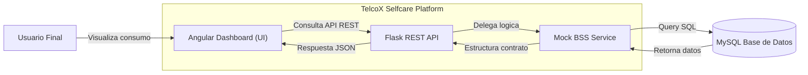

# Architecture Documentation

TelcoX Selfcare Platform esta disenada como una aplicacion fullstack contenerizada, enfocada en la mantenibilidad y una clara separacion de responsabilidades.

## Diagrama de Contenedores (C4 Model)

## Decisiones Tecnicas y de Negocio

### 1. Cliente Autenticado Simulado
El reto se centra en el modulo de visualizacion de consumo, por lo que no se implemento un flujo de login completo (como JWT o integracion Identity Provider). El frontend asume una sesion activa y consulta de forma determinista el cliente demo 1001 (Ana Torres). 

### 2. Simulacion BSS/CRM
Para emular una arquitectura empresarial donde un backend consulta a un sistema transaccional (BSS/CRM), se creo el contenedor logico mock_bss_service.py. Este servicio abstrae la conexion a MySQL. Si a futuro el sistema migra a integraciones por eventos o APIs reales de BSS, los controladores de Flask no sufriran cambios, respetando el principio de responsabilidad unica.

### 3. Contratos Pre-calculados
La API devuelve porcentajes pre-calculados (percentage: 36). Esto reduce la carga computacional y la logica de negocio en el frontend, manteniendo al cliente Angular como una capa puramente de presentacion (Dumb UI).

## Modulo de Consumo (Reglas de UI/UX)

El dashboard (UsageDashboardComponent) esta disenado bajo estandares de experiencia de usuario en telecomunicaciones:
1. Priorizacion Visual: Saldo disponible y barras de progreso para datos/minutos.
2. Estados Resilientes: 
   - Loading: Feedback visual mientras la API responde.
   - Error: Traduccion de errores tecnicos (bss_unavailable) a mensajes amigables con acciones de mitigacion (Boton "Actualizar").
3. Refresco Manual: Permite al usuario forzar una consulta bajo demanda hacia el backend.

## Estructura de Componentes

### Frontend (frontend/src/app/features/usage/)
Utiliza Standalone Components de Angular 19 para mantener una estructura agil sin modulos anidados innecesarios.
- models/: Contratos TypeScript (e.g., CustomerUsage).
- services/: Inyeccion HTTP hacia el backend.
- pages/: Componentes contenedores con la logica de presentacion.

### Backend (backend/app/)
- api/usage_routes.py: Capa de ruteo HTTP.
- services/mock_bss_service.py: Capa de dominio simulada.
