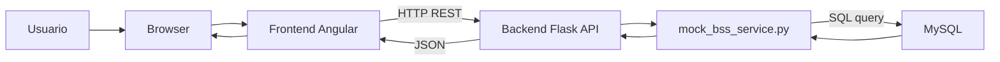

# Architecture Documentation

Documentacion de arquitectura para TelcoX Selfcare Platform.

## Vision general

TelcoX Selfcare Platform es una aplicacion fullstack para visualizar informacion de consumo de un cliente de telecomunicaciones.

El alcance implementado se centra en el modulo de visualizacion de consumo:

- Saldo disponible.
- Consumo de datos moviles.
- Consumo de minutos.
- Fecha de ultima actualizacion.
- Manejo de estados de carga, exito y error.

El objetivo principal es demostrar un flujo end to end funcional y mantenible:

```txt
Usuario -> Angular -> Flask REST API -> Servicio BSS simulado -> MySQL
```

## Diagrama de alto nivel



## Componentes principales

### Frontend Angular

Responsabilidades:

- Renderizar el dashboard de consumo.
- Consultar la API REST del backend.
- Mostrar estados de carga, exito y error.
- Presentar informacion clara para el usuario final.

Ubicacion principal:

```txt
frontend/src/app/features/usage/
```

Estructura:

```txt
features/usage/
├── models/
│   └── usage.model.ts
├── services/
│   └── usage-api.service.ts
└── pages/
    └── usage-dashboard/
        ├── usage-dashboard.component.ts
        ├── usage-dashboard.component.html
        └── usage-dashboard.component.css
```

El dashboard esta disenado como una pantalla de autogestion tipo telco, con informacion prioritaria visible:

- Nombre del cliente.
- Saldo disponible.
- Consumo de datos con barra de progreso.
- Consumo de minutos con barra de progreso.
- Estado del servicio.
- Ultima actualizacion.
- Accion de refrescar.

### Backend Flask

Responsabilidades:

- Exponer endpoints REST.
- Orquestar la consulta de consumo.
- Transformar la informacion a un contrato JSON claro.
- Manejar errores esperados.

Ubicacion principal:

```txt
backend/app/
```

Estructura:

```txt
app/
├── api/
│   └── usage_routes.py
├── services/
│   └── mock_bss_service.py
└── main.py
```

### Servicio BSS simulado

Archivo:

```txt
backend/app/services/mock_bss_service.py
```

Este servicio representa la integracion con un sistema BSS/CRM. Para el reto, el BSS se simula leyendo datos desde MySQL.

La separacion permite que la ruta HTTP no conozca detalles de persistencia. Si en el futuro se reemplaza MySQL por una API real de BSS, el cambio se concentraria en este servicio.

### MySQL

Responsabilidades:

- Almacenar los datos demo del cliente.
- Servir como fuente persistente para el backend.

Seed inicial:

```txt
infra/mysql/init.sql
```

Tabla principal:

```txt
customer_usage
```

Campos principales:

- `customer_id`
- `customer_name`
- `balance`
- `data_used`
- `data_total`
- `minutes_used`
- `minutes_total`
- `updated_at`

## Flujo de consulta de consumo

1. El usuario abre `http://localhost:4200`.
2. Angular carga el dashboard.
3. El componente solicita el consumo del cliente demo `1001`.
4. `UsageApiService` ejecuta una solicitud HTTP al backend.
5. Flask recibe la solicitud en:

```http
GET /api/customers/1001/usage
```

6. La ruta delega la consulta a `mock_bss_service.py`.
7. El servicio consulta MySQL.
8. El backend transforma la respuesta a JSON.
9. Angular recibe la respuesta.
10. El dashboard muestra saldo, datos, minutos y ultima actualizacion.

## Manejo de errores

La arquitectura contempla errores tanto en backend como en frontend.

### Backend

Errores manejados:

| Caso | Codigo HTTP | Error |
|---|---:|---|
| Cliente inexistente | 404 | `customer_not_found` |
| BSS/MySQL no disponible | 503 | `bss_unavailable` |
| Error inesperado | 500 | `internal_server_error` |

### Frontend

La UI traduce los errores tecnicos en mensajes amigables para el usuario:

- Backend no disponible.
- Cliente sin informacion de consumo.
- Error inesperado al consultar el consumo.

El boton de actualizar permite reintentar la consulta.

## Contenerizacion

El proyecto usa Docker Compose para levantar todos los servicios:

```txt
docker-compose.yml
```

Servicios:

| Servicio | Tecnologia | Puerto local |
|---|---|---:|
| `frontend` | Angular | 4200 |
| `backend` | Flask | 5001 |
| `mysql` | MySQL | 3307 |

Comando principal:

```bash
docker compose up --build
```

Para reconstruir desde cero incluyendo la base de datos:

```bash
docker compose down -v
docker compose up --build
```

## Decisiones tecnicas

### No se implemento login

El reto solicita el modulo de visualizacion de consumo, no autenticacion.

Para mantener el alcance enfocado, se simula un usuario autenticado usando el cliente `1001`.

En una implementacion real, el `customerId` vendria de:

- Sesion autenticada.
- Token JWT.
- Perfil de cliente en CRM.
- Seleccion de linea asociada al usuario.

### MySQL como fuente demo del BSS

Aunque el requerimiento habla de un backend ficticio que simule un BSS, tambien recomienda MySQL como base de datos.

Por eso se adopto un punto medio:

```txt
mock_bss_service.py -> MySQL
```

Esto permite demostrar persistencia y contenerizacion sin construir un BSS real.

### Contrato JSON simple

La respuesta incluye campos ya preparados para la UI:

- Totales.
- Valores usados.
- Unidad.
- Porcentaje calculado.

Esto reduce logica de presentacion en el frontend y mantiene un contrato claro.

### Angular standalone components

El frontend usa componentes standalone, que es el enfoque moderno de Angular.

Esto evita crear modulos innecesarios para un alcance pequeno y mantiene la estructura simple.
